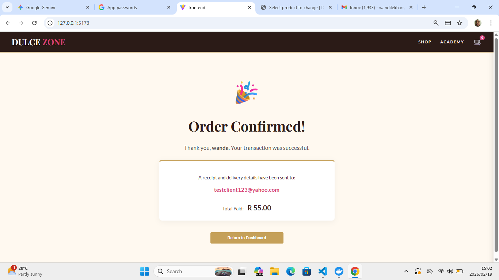

# 🍰 Dulce Zone Confectionery 

A premium, full-stack e-commerce and course-booking web application built for a high-end confectionery brand. This project features a decoupled architecture with a dynamic React frontend and a robust Django/GraphQL backend.

## ✨ Key Features

* **Mobile-First Responsive UI:** Sleek, modern frontend built with React.
* **GraphQL API:** Highly efficient data fetching.
* **Secure Payment Gateway:** Full integration with the Stripe API.
* **Automated SMTP Email System:** Instantly generates and delivers custom HTML receipts.

## 🚀 Local Setup & Installation

**1. Start the Backend (API & Database)**
Navigate to the backend directory and spin up the Docker containers:
`cd backend`
`docker-compose up`

**2. Start the Frontend (User Interface)**
Open a new terminal, navigate to the frontend directory, install dependencies, and start the development server:
`cd frontend`
`npm install`
`npm run dev`

---

## 📸 Application Gallery

**Mobile Shop View**

**Mobile Course View**

**Automated Email Receipt**

