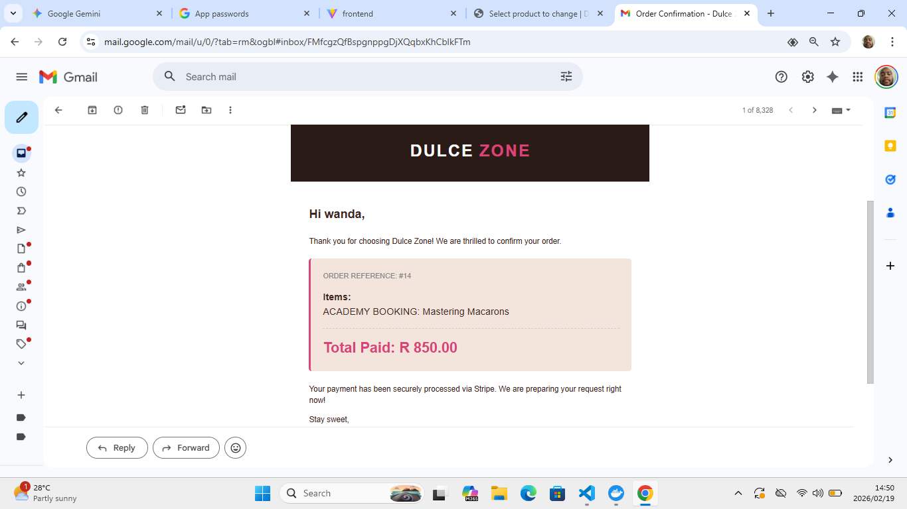
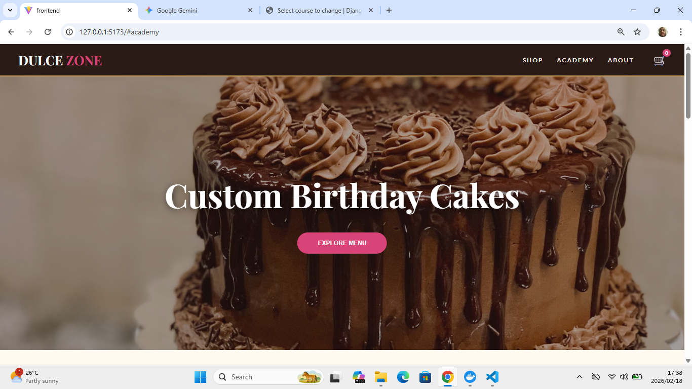

# 🍰 Dulce Zone Confectionery


A **premium full-stack e-commerce and course-booking web application** built for a high-end confectionery brand.  
The platform uses a **decoupled architecture** with a modern React frontend and a powerful Django + GraphQL backend, featuring **real-time inventory control** and **secure, bank-grade payments**.

---

## ✨ Key Features

- **Mobile-First Responsive UI**  
  Sleek React interface optimized for both mobile and desktop users.

- **GraphQL API**  
  Efficient data fetching for products, courses, bookings, and checkout workflows.

- **Secure Payment Gateway**  
  Stripe integration with tokenized credit-card payments.

- **Real-Time Inventory Management**  
  PostgreSQL ensures accurate stock levels and prevents course overbooking.

- **Automated SMTP Email System**  
  Sends branded HTML receipts to customers and instant sales alerts to the business owner.

- **Secure Merchant Portal**  
  Django Admin customized for non-technical owners to manage products, pricing, orders, and courses.

---

## 🛠️ Tech Stack

### Frontend
- React.js (Vite)
- Apollo Client (GraphQL state management)
- Modern CSS (Flexbox & Grid)

### Backend
- Python / Django
- Graphene-Django (GraphQL)
- PostgreSQL
- Django Core Mail (SMTP automation)
- Stripe Python SDK

### DevOps
- Docker & Docker Compose
- Git version control

---

## 🚀 Local Setup & Installation

You will need **two terminal windows** running at the same time.

---

### 1️⃣ Start the Backend (API & Database)

```bash
cd backend
docker-compose up

GraphQL API: http://localhost:8000/graphql/

Merchant Admin Portal: http://localhost:8000/admin/

2️⃣ Start the Frontend (User Interface)
cd frontend
npm install
npm run dev

Application URL: http://localhost:5173

📂 Project Architecture
dulce-confectionery/
├── backend/                  # Django & PostgreSQL environment
│   ├── business/             # Core app (models, admin, schema, templates)
│   ├── core/                 # Settings & URL configuration
│   ├── Dockerfile
│   ├── docker-compose.yml    # API + database orchestration
│   └── manage.py
│
├── frontend/                 # React application
│   ├── src/
│   │   ├── components/       # Reusable UI components
│   │   ├── pages/            # Views (Shop, Academy, Checkout)
│   │   └── App.jsx           # Apollo provider & routing
│   ├── package.json
│   └── vite.config.js
│
├── screenshots/              # README images (important!)
│   ├── mobile-shop.png
│   ├── mobile-course.png
│   └── email-receipt.png
│
└── README.md
📸 Application Gallery

Mobile-First Shopping Experience & Automated Email Receipts
   

🔐 Security & Best Practices

Tokenized payments via Stripe (no card data stored)

Environment variables for secrets

Database-level inventory enforcement

Django admin access protected by authentication