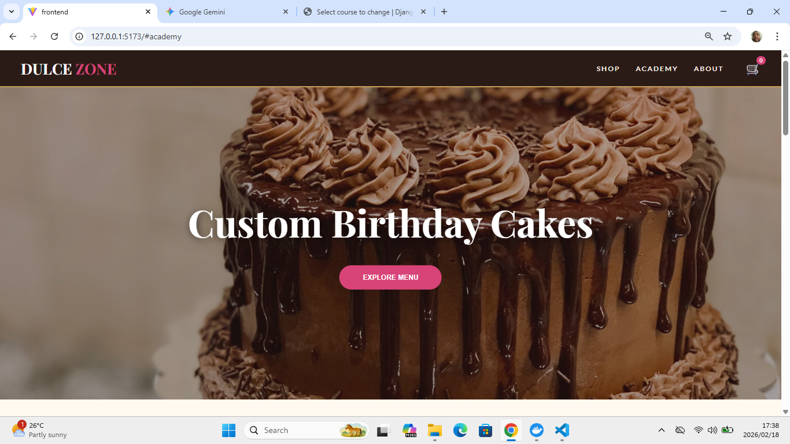
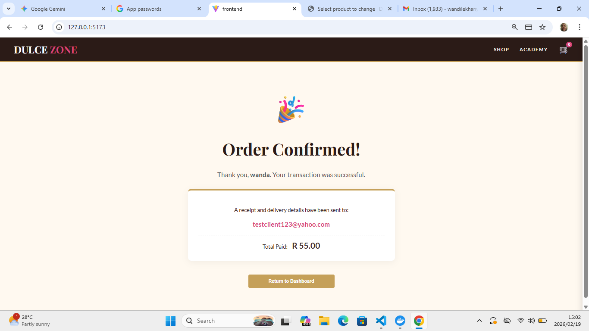
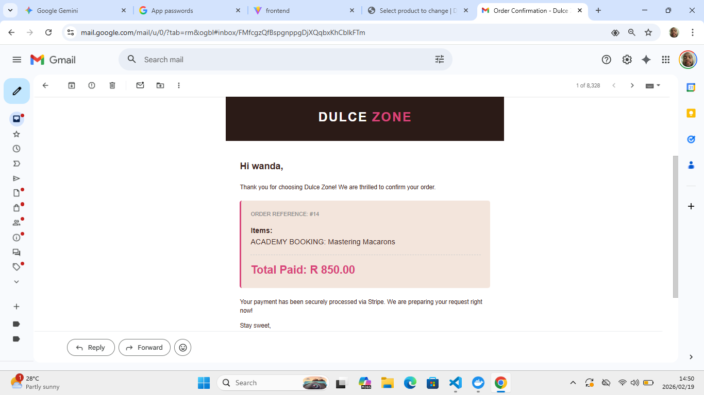

# 🍰 Dulce Zone Confectionery | Full-Stack E-Commerce Architecture


**Live Deployment:** [dulce-zone.vercel.app](https://dulce-zone.vercel.app)

A premium, production-ready e-commerce and course-booking engine designed for a high-end confectionery brand. Engineered with a decoupled architecture, this platform leverages a highly responsive React frontend and a robust Django/GraphQL backend to deliver seamless transactional checkouts and automated inventory management. 

Designed and deployed in a rapid 50-hour development sprint to demonstrate high-velocity, full-stack execution.

---


## 📸 Application Interface
=======

## Live Demo
https://dulce-zone.vercel.app

## 📸 Application Gallery
>>>>>>> 46f19ff7dbef3d7e7a58af6045ede0a1681bd942

> *Note: UI designed with a mobile-first approach to capture optimal conversion rates.*

| Mobile Storefront | Course Booking System | Automated Receipts |
| :---: | :---: | :---: |
|  |  |  |

*(Replace the image paths above with the actual high-res screenshots of your application)*

---

## ⚙️ System Architecture & Tech Stack

This project strictly separates the presentation layer from the business logic, ensuring scalability and secure data flow.

### Frontend (Client Layer)
* **Framework:** React.js
* **State Management:** React Context API / Hooks
* **API Integration:** Apollo GraphQL Client for optimized, over-fetching-proof queries.
* **Hosting:** Vercel (Edge Network)

### Backend (API & Database Layer)
* **Framework:** Django & Python
* **API Structure:** GraphQL (Graphene-Django)
* **Database:** PostgreSQL (Relational integrity for orders and user data)
* **Containerization:** Docker & Docker Compose
* **Hosting:** Render Cloud Infrastructure

---

## ✨ Core Business Features

* **Secure Payment Processing:** End-to-end integration with the Stripe API, utilizing webhooks to securely process payments and validate transactions before updating database inventory.
* **GraphQL Data Fetching:** Implemented advanced GraphQL mutations and queries to drastically reduce payload sizes and improve mobile loading speeds.
* **Automated SMTP Engine:** Custom Python email logic that instantly generates HTML-formatted receipts and booking confirmations upon successful Stripe webhooks.
* **Infrastructure Monitoring:** Integrated automated uptime monitoring to ensure API availability and track container cold-starts.

---

## 🚀 Local Development Setup

To run this architecture locally, ensure you have Docker and Node.js installed on your machine.

**1. Clone the Repository**
```bash
git clone [https://github.com/WANDART291/dulce-zone.git](https://github.com/WANDART291/dulce-zone.git)
cd dulce-zone


cd backend
# This builds the Django image and provisions the PostgreSQL database
docker-compose up --build

cd frontend
npm install
npm run dev

👨‍💻 Engineering Contact
Wandile Khanyile * Full-Stack Developer

GitHub: @WANDART291

